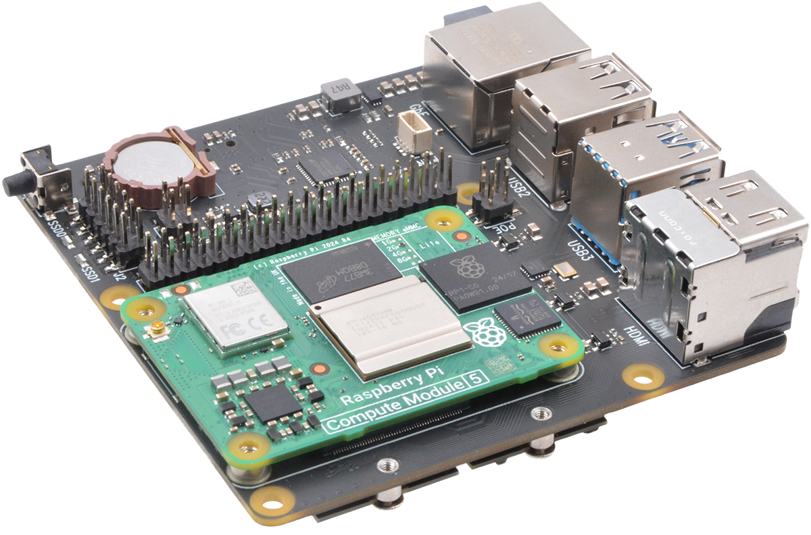

# Produkty

## Chytrá domácnost

### Domácí Server Malina 5

**Kompletní řešení pro správu a automatizaci vaší chytré domácnosti**

Jedná se o výkonný domácí server postavený na nejnovější technologii Raspberry Pi 5 s pokročilou deskou **Suptronics X1500**, kterou provozuje operační systém **Raspberry Pi OS**. Toto zařízení slouží jako centrální automat pro veškeré funkce vaší chytré domácnosti.

#### Technické specifikace

- **Procesor:** Raspberry Pi 5 Compute module (4GB RAM, 32GB eMMC)
- **Rozšiřující deska:** Suptronics X1500
- **Uložiště** NVMe SSD 250GB
- **Operační systém:** Raspberry Pi OS + vlastní rozšíření
- **Dostupný software:**
    - **Home Assistant** - intuitivní platforma pro správu chytré domácnosti
    - **MQTT** - protokol pro komunikaci IoT zařízení
    - **Zigbee2MQTT** - rozhraní technologie pro propojení senzorů a přístrojů

#### Klíčové výhody

✅ **Nízká energetická spotřeba** - ideální pro nepřetržitý provoz 24/7  
✅ **Dostatečný výkon** - plynulá obsluha všech funkcí chytré domácnosti  
✅ **Centrální řídící systém** - snadné propojení všech senzorů a zařízení od různých výrobců do jednoho rozhraní  
✅ **Bezpečnost a soukromí** - data zůstávají v domácnosti  
✅ **Snadné rozšiřování** - podpora dalších zařízení a služeb  

#### Možnosti rozšíření

- **NAS úložiště** - rozšíření o pevné disky **(NVMe SSD v režimu RAID)** s větší kapacitou pro zálohování a archivaci dat
- Další moduly a integrační prvky podle vašich potřeb

#### Správa a údržba

🌐 **Vzdálený přístup** - nabízíme možnost vzdálené kontroly bez fyzické přítomnosti  
⚙️ **Flexibilní konfigurace** - snadné přizpůsobení podle vašich specifických požadavků a přání

---

